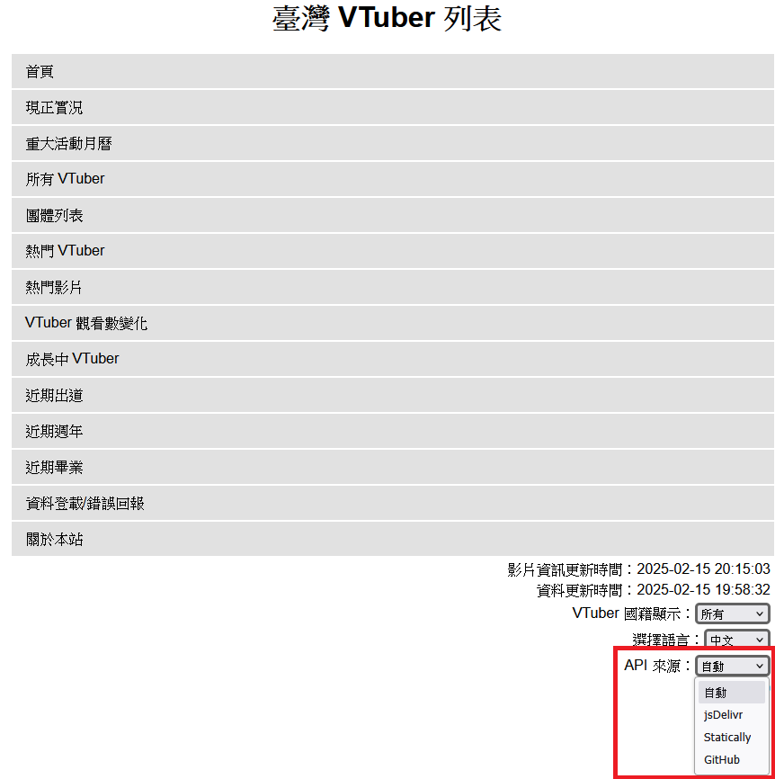

- [臺灣 VTuber 列表系統架構說明](#臺灣-vtuber-列表系統架構說明)
  - [臺灣 VTuber 列表網頁](#臺灣-vtuber-列表網頁)
  - [VTuber 資料儲存 (JSON)](#vtuber-資料儲存-json)
  - [VTuber 資料儲存 (CSV)](#vtuber-資料儲存-csv)
  - [出道 VTuber 資料儲存(已棄用)](#出道-vtuber-資料儲存已棄用)
  - [VTuber 資料格式轉換](#vtuber-資料格式轉換)
  - [VTuber 資料撈取](#vtuber-資料撈取)
  - [VTuber 名單維護者](#vtuber-名單維護者)
- [已存在系統說明](#已存在系統說明)
  - [YouTube Data API](#youtube-data-api)
  - [Twitch API](#twitch-api)
  - [GitHub](#github)
  - [jsDelivr](#jsdelivr)
  - [Statically](#statically)

# 臺灣 VTuber 列表系統架構說明

## 臺灣 VTuber 列表網頁

部署網頁：https://taiwanvtuberdata.github.io/

以 TypeScript + preact 編寫靜態網頁並部署於 GitHub Pages。

## VTuber 資料儲存 (JSON)

部署網址：https://github.com/TaiwanVtuberData/TaiwanVTuberTrackingDataJson

以 JSON 格式儲存 VTuber 最新資料。

## VTuber 資料儲存 (CSV)

部署網址：https://github.com/TaiwanVtuberData/TaiwanVTuberTrackingData

## 出道 VTuber 資料儲存(已棄用)

部署網址：https://github.com/TaiwanVtuberData/TaiwanVTuberDebutLiveStreams

以 CSV 格式儲存 VTuber 最新資料。

## VTuber 資料格式轉換

部署方式：虛擬機使用 Cronjob 定期執行

定期將 VTuber 資料由 CSV 轉換為 JSON 格式。

程式碼網址：
* [GenerateJsonFile](https://github.com/TaiwanVtuberData/VTuberTrackingDataProject/tree/master/GenerateJsonFile)

## VTuber 資料撈取

部署方式：虛擬機使用 Cronjob 定期執行

定期從 YouTube Data API、TwitchData API 取得 VTuber 各項資料。

程式碼網址：
* [FetchRecord](https://github.com/TaiwanVtuberData/VTuberTrackingDataProject/tree/master/FetchRecord)：抓取 VTuber 頻道詳細數據
* [FetchBasicData](https://github.com/TaiwanVtuberData/VTuberTrackingDataProject/tree/master/FetchBasicData)：抓取 VTuber 頻道基本資料

## VTuber 名單維護者

執行方式：使用者依據[資料登載/錯誤回報](https://taiwanvtuberdata.github.io/report-issue)網頁提供方法提交資料，並由維護者維護 VTuber 名單

# 已存在系統說明

## YouTube Data API

臺灣 VTuber 列表系統使用 [YouTube Data API](https://developers.google.com/youtube/v3/docs) 取得近期 VTuber 頻道資料，依照目前 (2024-05) 系統收錄的 VTuber 數量 (~2500) 必須申請較高的 API Quota，目前已申請之 Quota 為 15,0000。

## Twitch API

臺灣 VTuber 列表系統使用 [Twitch API](https://dev.twitch.tv/docs/api/) 取得近期 VTuber 頻道資料，目前 (2024-05) Twitch API 沒有限制使用量。

## GitHub

臺灣 VTuber 列表系統大量使用 GitHub Git Repository 當作資料儲存方案。

[臺灣 VTuber 列表網頁](#臺灣-vtuber-列表網頁)使用 [GitHub API](https://docs.github.com/en/rest) 存取 [VTuber 資料儲存 (JSON)](#vtuber-資料儲存-json) 檔案作為資料 API。

## jsDelivr

除了使用 GitHub API 外，[臺灣 VTuber 列表網頁](#臺灣-vtuber-列表網頁)也會使用 [jsDelivr](https://www.jsdelivr.com/) 提供的 API 存取 [VTuber 資料儲存 (JSON)](#vtuber-資料儲存-json)。

## Statically

除了使用 GitHub API 外，[臺灣 VTuber 列表網頁](#臺灣-vtuber-列表網頁)也會使用 [Statically](https://statically.io/) 提供的 API 存取 [VTuber 資料儲存 (JSON)](#vtuber-資料儲存-json)。

三種方式提供了相同的 API 格式，因此使用者可以簡單地透過網頁調整 API 來源：

